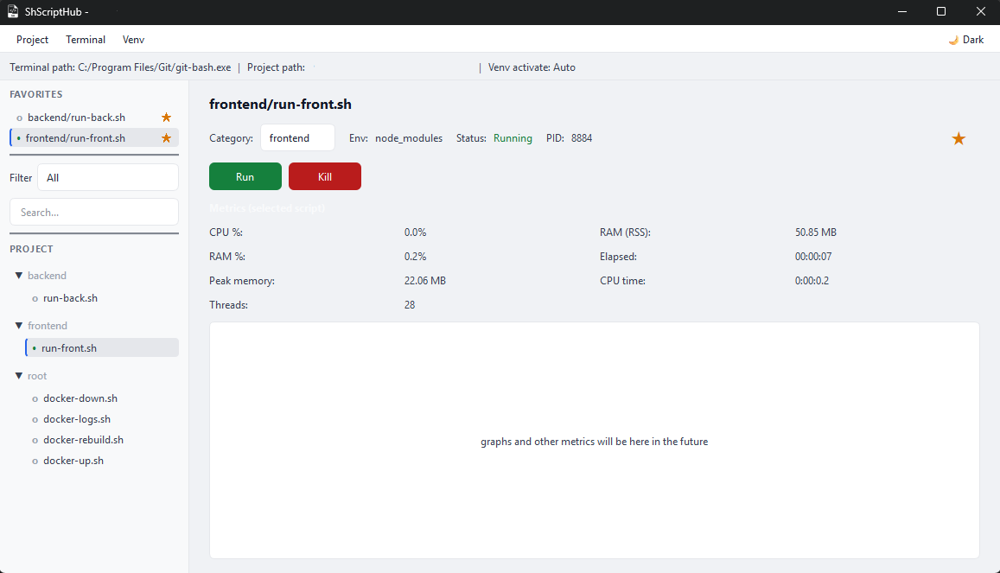

<div align="center">

# ShScriptHub

**Scans your project, detects environments and runs scripts.**

[](https://www.gnu.org/licenses/gpl-3.0.en.html)
[](https://www.microsoft.com/windows)
[](https://www.python.org/downloads/)
[](https://doc.qt.io/qtforpython-6/)


</div>

A `.sh` script runner for anyone tired of hopping between folders and scripts. It scans your selected folder to build a centralized hub, opens a new terminal per script for easier project management and auto-detects Python environments.



## 🛠️ Features

### Toolbar

Toolbar for easy configuration access:

- **Project** — Set project path | Refresh to rescan scripts
- **Terminal** — Set Git Bash path 
- **Venv** — Venv activate path for scripts that interact with Python | Clear venv path to revert to auto-detect.

All of the above, plus per-script categories and favorites, are stored in `config.json` in the app directory.

### Script cards

Scripts are shown in a responsive card grid. Each card has:

- **File name** — Relative to project root.
- **Favorite** — Star to pin; favorites sort first.
- **Category** — None, backend, or frontend; default from folder name, editable per script.
- **Env** — Shown per script.
- **Status** — Idle, Running, or Stopped.
- **Run** — Opens the configured terminal with CWD = script’s folder.
- **Kill** — Stops only the process tree launched by the app for that script.

### Metrics

When a script is running, each card shows these live metrics (updated every second):

- **PID** — Process ID.
- **CPU %** — Current CPU usage.
- **RAM (RSS)** — Resident memory in use (MB).
- **RAM %** — Share of system RAM.
- **Elapsed** — Time since the script started.
- **Peak memory** — Maximum RSS reached (MB).
- **CPU time** — Total CPU time consumed.
- **Threads** — Number of threads.

### Search and filter

- **Search** — Type in the search box to filter cards by folder or file name (live filter).
- **Folder** — Dropdown to show "All" or only scripts under a first-level folder (e.g. backend, frontend).


## 📁 How scripts are discovered

The app scans the **selected folder** recursively and lists every `.sh` file. Names are shown relative to the project (e.g. `backend/run.sh`, `scripts/docker-up.sh`). Scripts **run with CWD = their own folder**, not the project root.

**Env** is detected in the script’s folder: `.venv`, `venv`, or `node_modules`. For scripts in category **backend**, a configured venv path (see Configuration) overrides that.

Example layout (any structure works):

```
your-project/
├── backend/          # auto = backend; .venv/venv 
├── frontend/         # auto = frontend; node_modules
├── api/              # category to None
└── scripts/          # category None
```


## ⚙️ Setup & Run

### 1. Clone or open the project

```bash
git clone https://github.com/leobrqz/ShScriptHub.git
cd ShScriptHub
```

### 2. Install dependencies

```bash
pip install -r requirements.txt
```

### 3. Run the app

```bash
python src/main.py
```

## Credits

- [Icon](https://www.flaticon.com/free-icon/file_14390011) made by [jungsa](https://www.flaticon.com/authors/jungsa)

## Author

**Leonardo B.**

- GitHub: [leobrqz](https://github.com/leobrqz)
- LinkedIn: [leonardobri](https://linkedin.com/in/leonardobri)

Check out my other projects <3
