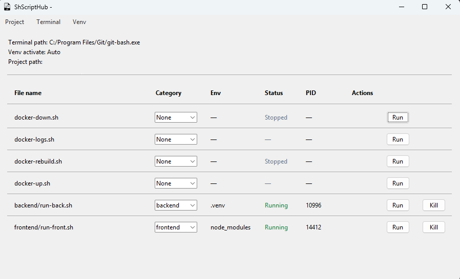

<div align="center">

# ShScriptHub

**Scans your project, detects environments and runs scripts.**

[](https://www.gnu.org/licenses/gpl-3.0.en.html)
[](https://www.microsoft.com/windows)
[](https://www.python.org/downloads/)


</div>

A `.sh` script runner for anyone tired of hopping between folders and scripts. Scans your selected folder to build a centralized hub, opens a new terminal per script for easier project management and auto-detects Python environments.


## 🛠️ Features



### Project

- **Select project folder** — Project → Set project path to choose any project root. the path is saved for next runs
- **Refresh** — Project → Refresh to rescan scripts without restarting

### Configuration

- **Terminal** — Set Git Bash path (prompted on first run)
- **Venv** — Optional **venv activate path** (for scripts you mark as backend; shows "Auto" when not set); **Clear venv path** to revert to auto-detect

### Table

- **File name** — Path relative to the project root
- **Category** — Defaulted by folder name (`backend/` or `frontend/`), but you can change it per script
- **Env** — Auto-detected in the script folder: `.venv`, `venv`, or `node_modules`; for **backend**, a configured venv path overrides auto-detect
- **Status** — Idle, Running, Stopped
- **Run** — Opens Git Bash with CWD set to the script’s folder
- **Kill** — Stops only the terminal launched by the app


## 📁 How scripts are discovered

The app scans the **selected folder** recursively and lists every `.sh` file. 

- **File name** — Shown as path relative to the project (e.g. `backend/run.sh`, `frontend/dev.sh`, `scripts/docker-up.sh`)
- **Working directory** — Scripts run relative to their own folder, not the project root
- **Env** — Environment is automatically detected in the script's folder (`.venv`, `venv`, `node_modules`). For backend scripts with a configured venv path, that path is used instead

Example layout (any structure works):

```
your-project/
├── backend/          # .sh scripts; category auto = backend; .venv/venv auto-detected
├── frontend/         # .sh scripts; category auto = frontend; node_modules shown if present
├── api/              # your own name; category defaults to None
└── scripts/          # category None; CWD = scripts/ when you run
```


## ⚙️ Setup & Run

### 1. Clone or open the project

```bash
git clone https://github.com/leobrqz/ShScriptHub.git
cd ShScriptHub
```

### 2. Run the app

```bash
python src/main.py
```

## Credits

- [Icon](https://www.flaticon.com/free-icon/file_14390011) made by [jungsa](https://www.flaticon.com/authors/jungsa)

## Author

**Leonardo B.**

- GitHub: [leobrqz](https://github.com/leobrqz)
- LinkedIn: [leonardobri](https://linkedin.com/in/leonardobri)

Check out my other projects <3
