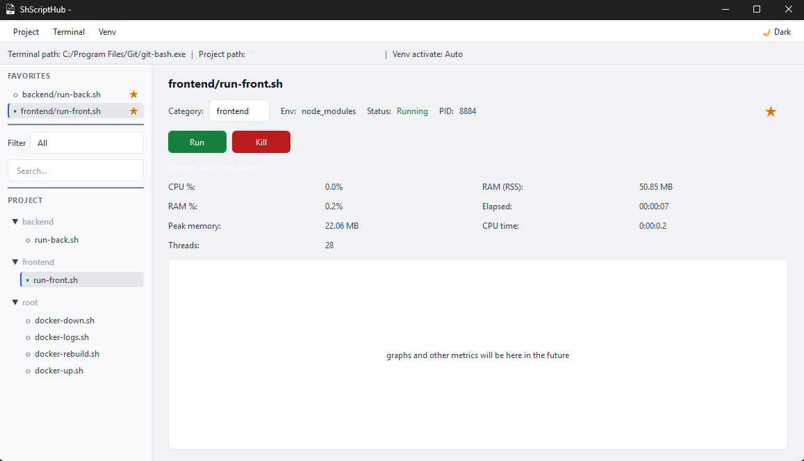

<div align="center">

# ShScriptHub

**Scans your project, detects environments and runs scripts.**

[](https://www.gnu.org/licenses/gpl-3.0.en.html)
[](https://www.microsoft.com/windows)
[](https://www.python.org/downloads/)
[](https://doc.qt.io/qtforpython-6/)


</div>

A `.sh` script runner for anyone tired of hopping between folders and scripts. It scans your selected folder to build a centralized hub, opens a new terminal per script for easier project management and auto-detects Python environments.



## Features

### Toolbar and navigation

Compact toolbar at the top of the window:

- **Project** — Set project path | Refresh to rescan scripts
- **Terminal** — Set Git Bash path
- **Venv** — Set venv activate path for scripts that interact with Python | Clear venv path to revert to auto-detect
- **Theme toggle** — Switch between dark and light themes (persisted across restarts)

- **Page selector** — Switch between **Home** (script detail panel) and **Scheduler** (schedules and run history). The sidebar remains visible in both views.

All settings, per-script categories, and favorites are stored in `config.json` in the app directory.

### Sidebar

Scripts are listed in a collapsible folder tree on the left panel:

- **Favorites section** — Favorited scripts are pinned at the top.
- **Project tree** — Scripts grouped by their first-level folder. Folders can be expanded or collapsed.
- **Search** — Filters the tree by folder or file name as you type.
- **Filter** — Dropdown to show All, Backend, Frontend, or Running scripts only.
- **Running indicator** — A dot next to each script shows whether it is currently running.
- **Selection** — Clicking a script loads its details in the detail panel.

### Detail panel

The right panel shows the selected script's full information and controls:

- **Name and path** — Script name and relative path from project root.
- **Category** — Per-script category selector (None, backend, frontend). Defaults are inferred from folder name.
- **Env** — Detected environment for the script (`.venv`, `venv`, `node_modules`, or configured venv path).
- **Status** — Idle, Running, or Stopped.
- **Favorite** — Star button to pin or unpin the script.
- **Run** — Opens the configured terminal with CWD set to the script's folder.
- **Kill** — Stops only the process tree launched by the app for that script.

### Live metrics

When a script is running, the detail panel shows these metrics updated every second:

- **CPU %** — Current CPU usage.
- **RAM (RSS)** — Resident memory in use (MB).
- **RAM %** — Share of system RAM.
- **Elapsed** — Time since the script started.
- **Peak memory** — Maximum RSS reached (MB).
- **CPU time** — Total CPU time consumed.
- **Threads** — Number of threads.

### Script viewer

The detail panel includes a read-only viewer that displays the selected script's source code with syntax highlighting:

- Shell keywords, strings, variables, comments, shebangs, and numbers are each coloured distinctly.
- Line numbers are shown in the left gutter.
- Horizontally scrollable for long lines.
- Colors adapt to the active theme (dark or light).

### Scheduler

A dedicated **Scheduler** page (via the Home | Scheduler selector) lets you run scripts automatically on a schedule.

**Schedules view:**

- **New Schedule** — Create time-based (specific hour:minute) or interval-based (every N minutes/hours) schedules.
- **Table columns** — Name, Script, Rule, Next Run, Status, Enabled toggle, Delete.
- **Live countdown** — When a schedule is enabled, the Next Run column updates every second. When disabled, shows "Disabled".
- **Interval reset on enable** — Toggling a disabled interval schedule back ON resets the countdown from the full interval.
- **Row actions** — Click a row to edit; use the toggle to enable/disable; use the trash icon to delete.

**History view:**

- **Filter** — All, started, killed, exited, failed.
- **Columns** — Schedule name, Script path, Time, Status.
- **Sub-row details** — Started and Finished timestamps on separate lines; for killed runs, shows "Previous instance terminated by scheduler".
- **Manual kill detection** — When you manually kill a scheduled script, the history entry is updated to "killed" with the correct finished time.

Schedules and run history are stored in `schedules.json` and `scheduler_history.json` in the app directory.

## How scripts are discovered

The app scans the **selected folder** recursively and lists every `.sh` file. Names are shown relative to the project root (e.g. `backend/run.sh`, `scripts/docker-up.sh`). Scripts **run with CWD = their own folder**, not the project root.

**Env** is detected in the script's folder: `.venv`, `venv`, or `node_modules`. For scripts in category **backend**, a configured venv path (see Toolbar) overrides auto-detection.

Example layout (any structure works):

```
your-project/
├── backend/          # auto = backend; .venv/venv
├── frontend/         # auto = frontend; node_modules
├── api/              # category None
└── scripts/          # category None
```


## Setup & Run

### 1. Clone or open the project

```bash
git clone https://github.com/leobrqz/ShScriptHub.git
cd ShScriptHub
```

### 2. Install dependencies

```bash
pip install -r requirements.txt
```

### 3. Run the app

```bash
python src/main.py
```

## Credits

- [Icon](https://www.flaticon.com/free-icon/file_14390011) made by [jungsa](https://www.flaticon.com/authors/jungsa)

## Author

**Leonardo B.**

- GitHub: [leobrqz](https://github.com/leobrqz)
- LinkedIn: [leonardobri](https://linkedin.com/in/leonardobri)

Check out my other projects <3
